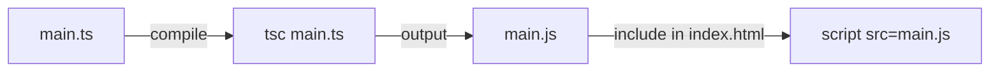

# Temat: Wprowadzenie do TypeScript

## Przydatne linki:
[typescriptlang.org](https://www.typescriptlang.org)

[Typescript Cheatsheet](https://www.typescriptlang.org/cheatsheets/)

[TypeScript in 5 minutes](https://www.typescriptlang.org/docs/handbook/typescript-in-5-minutes.html)

[Typescript From Scratch](https://www.typescriptlang.org/docs/handbook/typescript-from-scratch.html)

[TypeScript Coding Guidelines](https://github.com/microsoft/TypeScript/wiki/Coding-guidelines
)

[A curated list of tools, libraries, frameworks, and resources for TypeScript.](https://github.com/brandonhimpfen/awesome-typescript)

[roadmap.sh - TypeScript](https://roadmap.sh/typescript)

[YT - Where TypeScript Excels](https://www.youtube.com/watch?v=BUo7B6UuoJ4)

[What is TypeScript](https://thenewstack.io/what-is-typescript/)

[Microsoft for JavaScript developers](https://developer.microsoft.com/en-gb/javascript/)

[Discord - Typescript community](https://discord.com/invite/typescript)

[stackoverflow - tag TypeScript](https://stackoverflow.com/questions/tagged/typescript)

[JavaScript Guide](https://developer.mozilla.org/en-US/docs/Web/JavaScript/Guide)

[TypeScript Examples](https://www.typescriptlang.org/play/?#code/PTAEEEDsE9QSwM6gC4AsCmoAq0AO6BlAYwCc5dlR0EiBDfUIgG1oFcF0A6UATQHtWjWpFDtMw2Mj4AoEFThp0JUABN0zWiXGgORZHD4i+AM1DQByonzUo+oAEaYV0SLQC2cIqGErZYAFK0AG60xGQUoExwANboADSgfMpSoADuSdHeJAKQKpFwHsi0+oZIcCKKfih4mAjQCMjobpzSVeCgAOZ81kIcoMZJ3jDwSP4EAPIAcqC4mgjlHQBcrVaQDaBu0OP2AFbqlAC8oGNTnLMkHAAUAEQA3gC+1wCUANytclCwahpaSCk4+DC5EoKWQJHYlHMrEs1nESEcCyqCFoxkwjjoYjMAlA0UgfFSGyS4nsAkoCm4AFEgugRHBTGhiiMqnjKA0yHomJJwVxQAAxQboAAe7lwTHiKFQiEYsLSAiYeVItAQqGW0k22z2ek4gs40E4AC83lUAKrzSAdIZDWAdODUpBQiXEuBRZCSOypMiNaU2Zh8DjJGRyJJwG2uJjHYKhUjAtIKVCOlAkWhqAC0JlMJmqDGRqNdLSqEhGG1YRHjUVi3lAAHJXQxUs6VHQSCoq2lJaWsYI6CItKLaER0FV62grVnMJchQOIpB0NSSE9bBtaBXDJha3D5h1XPYxVVQRhEooSPnviwtP1WJA9AYRGp7KwOpcQkxWOhFlanu+gnw4CojXeHxuWgdDBBZnjeADHwAJgAZleaRIMuW5pSYJJ32uHdX2uUB7ngqoKX7eM6CYcMUkgotaBI-F0DydE2D6B0rFYeVQF7FgB0dAthmHeNFDHRJ6QPTQOlYNwaRBOw3GKUt8zkAFCGjCJ6xIlBl0wcoUn7JjIBBA9cD9BQbwEzi5AkMpbzpVEtB0-okjcBAEgGZQhRFMVYxHRQ+mQVhRWoKonITYxL2vQwshEsSdJPdQz0wIKrxKEQEFSehLkFd8AG1IFExwSASNkFgAXU-UB0vy80EiytwcoK-9os0TBVnWWY4BIDKJASCQaukJKUua+cjTkg9iNIuwetwCiqNSGiHHUei1yEkhwvEoQREcKopOQUtpvsWA2P7BZApa9ZC3KGZaBa9z40qnKuLyPjdEMPIAAMJCey6QLIc1ZLAABJekfLFJB6tAGcCRSKE8vQN8qGFNxfMWbzfIQd4wGNSBcXxWkgZ0OAdwO9dF3a+BTBOoGSVYVlaGgRE5GuH6cTxAlUlQYoq3hahkGuBJFBES8MdSLHK2St0dCp0A6arNxmT4VloUwZnGSlRwGjyuwHRnabQXQFSsAIBN12uKoXLhsVFj5xnIBTHwUxnOdpCAA)

https://www.plukasiewicz.net/TypeScript/Introduction
https://www.typescriptlang.org/why-create-typescript/
https://www.freecodecamp.org/news/search/?query=typescript

## Czym jest TypeScript i czym różni się od JavaScriptu?

TypeScript to nadzbiór (superset) JavaScriptu stworzony przez Microsoft. Dodaje do JavaScriptu statyczne typowanie oraz zaawansowane mechanizme obiektowe. Każdy poprawny kod JS jest poprawnym kodem TS.

## Jak przeglądarka uruchamia kod TypeScript?

Przeglądarki nie potrafią natywnie wykonywać kodu TypeScript. **Przed uruchomieniem kod TS musi przejść przez proces transpilacji** (kompilacji z TS do JS) za pomocą kompilatora tsc lub narzędzi takich jak Vite, esbuild czy SWC. Wygenerowany plik .js jest tym, co trafia do przeglądarki lub środowiska Node.js (albo innego jak Deno czy Bun).




## Czym różni się typowanie statyczne od dynamicznego?

- Typowanie dynamiczne (`JavaScript`): **Typ zmiennej jest przypisywany w czasie wykonywania programu** (`runtime`) i może się dowolnie zmieniać.
- Typowanie statyczne (`TypeScript`): **Typ zmiennej jest sprawdzany podczas kompilacji** (`build time`). Próba przypisania wartości innego typu wywołuje błąd kompilatora.

## Jak zainstalować TypeScript 
Wewnątrz projektu: `npm install typescript`
Globalnie: `npm install -g typescript`
> [!NOTE]
> `npm` to skrót od `node package manager`,by go używać należy pobrać `NodeJS` 


## `tsc` kompilator TypeScript
```bash
# Run a compile based on a backwards look through the fs for a tsconfig.json
tsc
# Emit JS for just the index.ts with the compiler defaults
tsc index.ts
# Emit JS for any .ts files in the folder src, with the default settings
tsc src/*.ts
# Emit files referenced in with the compiler settings from tsconfig.production.json
tsc --project tsconfig.production.json
# Emit d.ts files for a js file with showing compiler options which are booleans
tsc index.js --declaration --emitDeclarationOnly
# Emit a single .js file from two files via compiler options which take string arguments
tsc app.ts util.ts --target esnext --outfile index.js
``` 
>źródło: https://www.typescriptlang.org/docs/handbook/compiler-options.html

## plik `tsconfig.json`
```json
{
  // Visit https://aka.ms/tsconfig to read more about this file
  "compilerOptions": {
    // File Layout
    "rootDir": "./src",
    "outDir": "./dist",

    // Environment Settings
    // See also https://aka.ms/tsconfig/module
    "module": "esnext",
    "target": "es2025",
    "types": [],
    // For nodejs:
    // "lib": ["esnext"],
    // "types": ["node"],
    // and npm install -D @types/node

    // Other Outputs
    "sourceMap": true,
    "declaration": true,
    "declarationMap": true,

    // Stricter Typechecking Options
    "noUncheckedIndexedAccess": true,
    "exactOptionalPropertyTypes": true,

    // Style Options
    // "noImplicitReturns": true,
    // "noImplicitOverride": true,
    // "noUnusedLocals": true,
    // "noUnusedParameters": true,
    // "noFallthroughCasesInSwitch": true,
    // "noPropertyAccessFromIndexSignature": true,

    // Recommended Options
    "strict": true,
    "jsx": "react-jsx",
    "verbatimModuleSyntax": true,
    "isolatedModules": true,
    "noUncheckedSideEffectImports": true,
    "moduleDetection": "force",
    "skipLibCheck": true,
  }
}

```
## pliki wynikowe
### plik `${name}.js` 
plik zawierający transpilowany kod, który możemu użyć w naszej aplikacji/stronie/przeglądarce

### plik `${name}.d.ts` 
Pliki `${name}.d.ts` służą głównie do deklarowania typów danych w plikach, w przypadkach gdy TypeScript nie jest w stanie ich odczytać. Na przykład, TypeScript zazwyczaj nie potrafi określić typów danych w pliku JavaScript, więc biblioteki eksportujące kod JavaScript często zawierają pliki .d.ts , które deklarują typy wszystkich funkcji, które mogą być eksportowane. Jeśli piszesz nowy kod TypeScript, nie powinieneś więc pisać plików .d.ts dla pisanego przez Ciebie kodu, ponieważ jest on już w TypeScript.
>źródło: https://www.reddit.com/r/typescript/comments/r69jmi/whats_the_difference_between_ts_and_dts_file/

### plik `${name}.js.map`
Pliki map źródłowych (`${name}.js.map`) zawierają definicje mapowania, które łączą każdy fragment wygenerowanego kodu JavaScript z konkretną linią i kolumną odpowiadającego mu pliku TypeScript. Definicje mapowania w tych plikach są zapisane w formacie JSON.
Gdy mapy źródłowe są włączone, podczas debugowania program Visual Studio Code oraz narzędzia Chrome DevTools będą wyświetlać kod TypeScript zamiast wygenerowanego, skomplikowanego kodu JavaScript.
>źródło: https://stackoverflow.com/questions/17493738/what-is-a-typescript-map-file